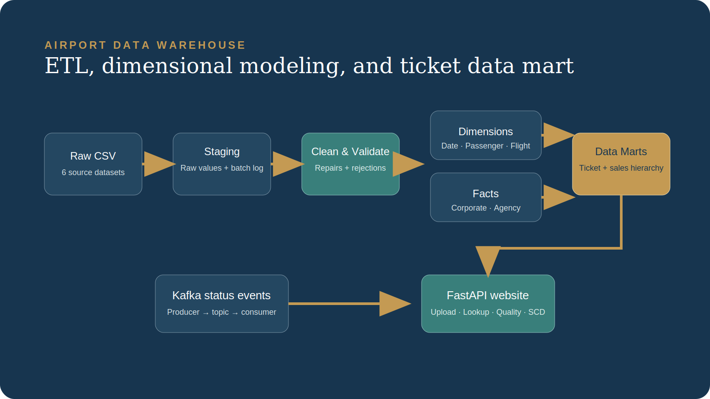

# Airport Data Warehouse and Flight Operations Data Mart

A data warehousing and analytics application that transforms airline, airport, passenger, flight, corporate-sales, and travel-agency records into a structured dimensional warehouse.

The project includes data validation, ETL processing, Slowly Changing Dimension Type 2 history, fact and dimension tables, ticket-level data marts, flight-status event processing, and a FastAPI-based operations interface.



## Project Overview

The system processes fragmented airport-related source files and converts them into warehouse-ready datasets through the following workflow:

```text
Raw source files
        ↓
Data validation and cleaning
        ↓
Standardized dimensions and facts
        ↓
SCD Type 2 passenger history
        ↓
Ticket and sales data marts
        ↓
FastAPI operations interface