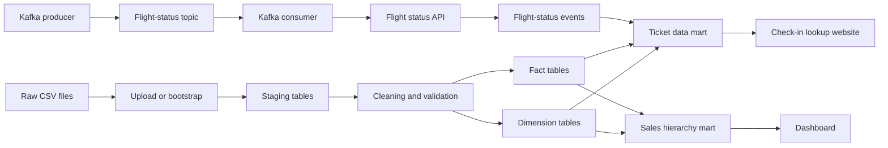

# Architecture

## End-to-end flow



## Warehouse grain

### Corporate sales fact

One row represents one corporate ticket transaction for one passenger, one flight, and one transaction date.

### Agency sales fact

One row represents one travel-agency ticket transaction for one passenger, one flight, and one transaction date.

### Ticket data mart

One row represents one loaded sales transaction enriched with current route, airline, passenger version at fact load time, latest flight-status event, and eligibility result.

## Dimension strategy

- `dim_date`: fixed daily calendar hierarchy
- `dim_passenger`: SCD Type 2
- `dim_airline`: SCD Type 2 capable
- `dim_airport`: SCD Type 2 capable
- `dim_flight`: current flight route and aircraft attributes

## Application layers

```text
Browser
  ↓
FastAPI routes and templates
  ↓
ETL and data-mart services
  ↓
SQLite / PostgreSQL / Supabase
```

The frontend never contains database credentials. Supabase access is server-side only.
